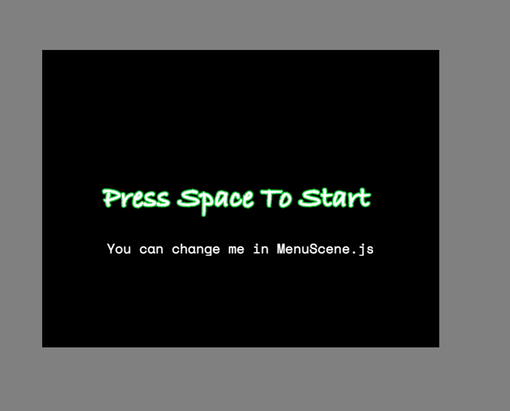

# "RFP Project"

This project is meant to improve your knowledge and understanding Javascript. In this project we will use a library called [Phaser.js](https://phaser.io/) to create our own Game. Phaser.js is a Javascript (js) game framework. A framework is a set of code that contains commonly used tools. The reason we use a framework is so that we can focus on writing the unique code for our game and not reinventing the wheel for generic aspects of our game.

## Getting Started

First download this project on to your computer. The easiest way to do this is to click the green Code button on the top right of this page and then click "Open with GitHub Desktop". **TODO: any more steps?**

Before we get started we should understand how our project is organized and what all the existing files do.

### Project Files Overview

In the root folder of our project we should see two folders and some files.

- `src` is the folder containing all of our code. Everything we do will be done to files inside of here.
- `package.json` and `package-lock.json` are files that you will find in most Javascript projects. They contain a list of libraries that our project uses. If you look inside `package.json` you should see a line with the word "phaser". Next to it is the version of the Phaser library we are working with. You can pretty much ignore the `package-lock.json` file. It gets automatically generated for us and is used behind the scenes.
- `.gitattributes` and `.gitignore` are two files used by Git. `.gitignore` contains a list of files and folders we do not want Git to know about. For example, our operating system sometimes adds files to folder. These files are not important for our project.
- `.eslintrc.js` is a file that sets up some code formatting rules. For example, in Javascript you can use any number of spaces you want for indentation. In order to stay consistent we will put our preference in this file and VS Code will automatically format our code using these.

### Running the Project

Before we begin coding, lets make sure this code actually runs on our computer. In VS Code click the Terminal dropdown in the menu bar and click "New Terminal". A window should open in the lower half of your screen.

In the terminal window type:

`npm install`

This will install the libraries our project uses.

Next type:

`npm run start`

You should see a message saying `Server running at http://localhost:1234`. If so, go to [http://localhost:1234](localhost:1234) in your web browser.

If everything worked as intended we should see a game load in our browser like so:

## A Few More Notes

This project is set up to use a library called [Parcel](https://parceljs.org/). If you would like to know what Parcel does you can [watch this video](https://www.youtube.com/watch?v=5IG4UmULyoA). Just be aware this is a semi-complicated topic and you do not need to understand how Parcel works for this project.